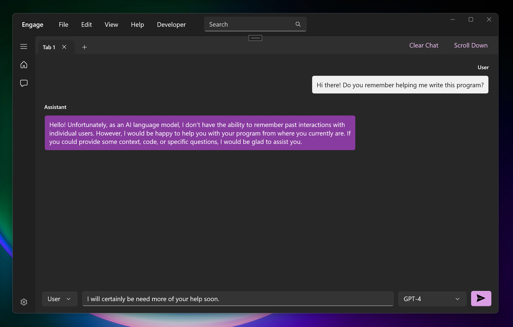

# Engage for Windows

Engage is a personal project for learning WinAppSDK, WinUI3, and Windows development in general. Currently, the app allows the user to select a GPT model to chat with. The goal of this project is to create a fully functional chat application using WinAppSDK and WinUI3.

## Current Features

Engage currently includes the following features:

- Chatting with the OpenAI API

## Dependencies

I don't really know, except I built it with Windows App SDK 1.2 and WinUI 3, while running Windows 11 Home Canary Build 25324. Sorry 😬

## Getting Started

To get started with Engage, follow these steps:

1. Clone the repository to your local machine using `git clone https://github.com/iamhazel/engage.git`.
2. Open the Engage solution file in Visual Studio.
3. Build and run the solution.

Note that Engage requires the WinAppSDK and WinUI3 frameworks to be installed in order to build and run the application.

## Contributing

Contributions to Engage are welcome! However, please note that this is a personal project for learning purposes, and I may not be able to review and merge pull requests in a timely manner. Additionally, as I am new to GitHub collaboration, it may take me some time to learn how to manage the repository and review pull requests effectively.

That being said, if you would like to contribute to the project, please feel free 😊
